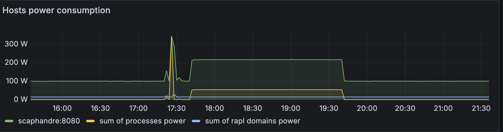
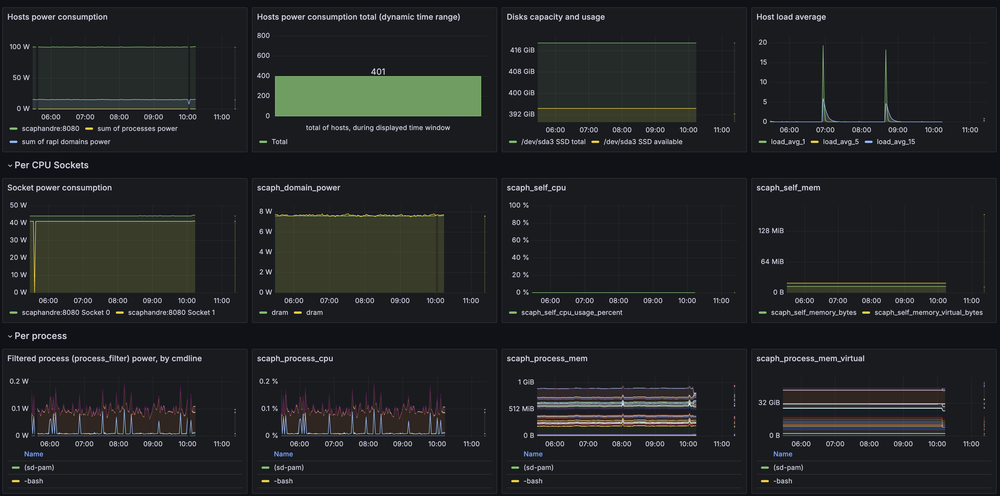
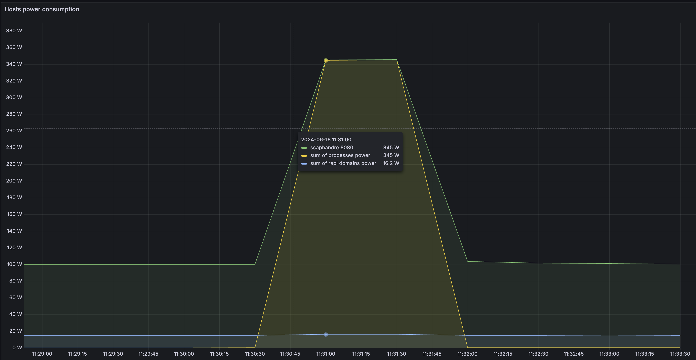

# Power Measurement and Managment on Chameleon



A common question we get is “how can I see how much power my node is using?” Because the node is sitting in one of Chameleon’s Datacenters, we can’t just plug it into a smart outlet and watch what it draws (There are smart PDUs on the market, we just don’t have them right now).

However, all of our “server-class” nodes make this information available to the operating system, and we can get at this information in a few ways. The Intel RAPL (Running Average Power Limit Energy Reporting) framework has the CPU self-report information about the joules used by each processor, and by other subsystems, such as memory.

The "baseboard management controller (BMC)" on each system may also provide information from the power supplies, this can be useful for getting a total system level measurement including fans, cooling, and other overhead.

## Getting system-level power information from the BMC

Most "normal" Chameleon baremetal nodes support IPMI and the "Data Center Manageability Interface (DCMI)". This includes all of the Intel and AMD based `compute_` and `gpu_` nodes. Some special case nodes like FPGAs and arm64 do not support this, as the vendor didn't implement the interface.

```
sudo apt install freeipmi-tools
sudo ipmi-dcmi --get-system-power-statistics
```
```
Current Power                        : 226 Watts
Minimum Power over sampling duration : 0 watts
Maximum Power over sampling duration : 650 watts
Average Power over sampling duration : 236 watts
Time Stamp                           : 06/18/2024 - 16:49:22
Statistics reporting time period     : 1000 milliseconds
Power Measurement                    : Active
```

This data is generally accurate, but doesn't update very frequently (ususally several seconds at the fastest). It's most useful for logging power data over hours to days.


## RAPL: Getting information from the CPU

Intel's RAPL makes information available via a several registers, including `MSR_PKG_Energy_Status` and `MSR_PP0_Energy_Status`, which update on the order of milliseconds. This makes information available with a much finer time resolution than from the BMC, but it is not "complete", genetrally only including power usage from the CPU and Memory subsystems.

Rather than write code to query these interfgaces directly, we'll leverage some existing tools to get at the data.


### A simple example with `Perf`

For more detailed and timely information, we can query the CPU using the RAPL interface. This information is updated on the order of milliseconds, althiough we are limited by the overhead of querting it.

First, for a simple example with “perf”:

```shell
# install linux-tools for your running kernel, to get the `perf` tool
sudo apt-get install "linux-tools-$(uname -r)"

# Make sure intel rapl kernel moduel is loaded
sudo modprobe intel_rapl_msr

# Finally, we'll ask the kernel how many joules `sleep 1` used
sudo perf stat -e power/energy-pkg/,power/energy-ram/ sleep 1
```

Example Results:
```
Performance counter stats for 'system wide':

             85.17 Joules power/energy-pkg/
             15.17 Joules power/energy-ram/

       1.001343899 seconds time elapsed
```

### Using `scaphandre` to get per-process information

However, we can do better with the information available: Scaphandre is a powerful tool that combines this information from RAPL, as well as information about how much cpu time each process is using, to make good estimates of per-process power. [For a comprehensive explanation of how/why it works, take a look at their docs](https://hubblo-org.github.io/scaphandre-documentation/explanations/how-scaph-computes-per-process-power-consumption.html).


Scaphandre is built in rust, so we can ether install the rust deps, or pull their docker container.

```
# install dependencies for building scaphandre
sudo apt-get install \
    pkg-config \
    cargo \
    rustup \
    libssl-dev

cargo install scaphandre
```

Now, we can run scaphandre and see what it shows us:

`sudo ~/.cargo/bin/scaphandre  stdout --timeout 10 --step 1`

```
...
------------------------------------------------------------

Host:	100.568017 W from
	package 	dram
Socket1	41.074833 W |	7.629241 W

Socket0	44.256115 W |	7.599235 W

Top 5 consumers:
Power		PID	Exe
0.6129861 W	130088	"/home/cc/.cargo/bin/scaphandre"
0.009577908 W	116790	"/usr/bin/containerd"
0 W	167	""
0 W	1139	""
0 W	117309	""
------------------------------------------------------------
```


Lets install a benchmarking tool, `stress-ng`, and run that while we monitor usage.

```
# install stress-ng
sudo apt install stress-ng

# run stress-ng for 60s, with parameters to:
# use a single thread to load the CPU
# ping the thread to only core ID 0
# and run in the backround

stress-ng --taskset 0 --cpu 1 --timeout 60s &

# run scaphandre again
sudo ~/.cargo/bin/scaphandre  stdout --timeout 10 --step 1

```

And teh results:
```
------------------------------------------------------------

Host:	105.828908 W from
	package 	dram
Socket1	41.515255 W |	7.549873 W

Socket0	49.148525 W |	7.582383 W

Top 5 consumers:
Power		PID	Exe
1.105572 W	130281	"/usr/bin/stress-ng"
0.720596 W	130284	"/home/cc/.cargo/bin/scaphandre"
0.009871177 W	116790	"/usr/bin/containerd"
0.009871177 W	94531	""
0 W	275	""
```

## Collecting longer term data and plotting it

Both of these methods (`perf` and `scaphandre`) have just been printing human readable text. However, we can easily get machine readable output.

Scaphandre offers a bunch of helpful methods, like saving results to a json file.
Or, for something fully integrated, you can run it as a prometheus exporter.

To try this out, we'll grab scaphandre's git repo, and use their example docker-compose file to run scaphandre to export the power data, prometheus to query it, and grafana to plot it.


1. If your image doesn't have it, we'll need to install docker and docker-compose
    ```
    # Add Docker's official GPG key:
    sudo apt-get update
    sudo apt-get install ca-certificates curl
    sudo install -m 0755 -d /etc/apt/keyrings
    sudo curl -fsSL https://download.docker.com/linux/ubuntu/gpg -o /etc/apt/keyrings/docker.asc
    sudo chmod a+r /etc/apt/keyrings/docker.asc

    # Add the repository to Apt sources:
    echo \
    "deb [arch=$(dpkg --print-architecture) signed-by=/etc/apt/keyrings/docker.asc] https://download.docker.com/linux/ubuntu \
    $(. /etc/os-release && echo "$VERSION_CODENAME") stable" | \
    sudo tee /etc/apt/sources.list.d/docker.list > /dev/null
    sudo apt-get update

    sudo apt-get install docker-ce docker-ce-cli containerd.io docker-buildx-plugin docker-compose-plugin
    ```
2. grab the scaphandre git repo
    ```
    git clone https://github.com/hubblo-org/scaphandre.git
    ```
3. for security, change promethus and scaphandre to listen on localhost, and change the grafana password to `mysuperdemopassword`
    ```
    cd scaphandre/docker-compose/
    sed -i 's/8080:8080/127.0.0.1:8080:8080/' docker-compose.yaml
    sed -i 's/9090:9090/127.0.0.1:9090:9090/' docker-compose.yaml
    sed -i 's/secret/mysuperdemopassword/' docker-compose.yaml
    ```
4. check your public IP, and access grafana in your browser on port 3000, with credentials `admin/mysuperdemopassword`
    

5. Finally, lets kick off a big stress test on all cpu cores:
    ```
    stress-ng --cpu $(nproc) --timeout 60
    ```
    ```
    stress-ng: info:  [133743] setting to a 60 second run per stressor
    stress-ng: info:  [133743] dispatching hogs: 96 cpu
    ```
    


Using this approach, you can use promethus on one node to monitor power consumption of multiple others, as well as related metrics like cpu usage.

## Combining data from DCMI and RAPL

For best results, youll want both system-level power from DCMI, and cpu/memory/process level data from RAPL. To do this, with prometheus, you can run a combination of the scaphandre prometheus exporter, and the [prometheus ipmi exportert](https://github.com/prometheus-community/ipmi_exporter) which calls the above `ipmi-dcmi` commands.

For a simple script, check out the [Energizta](https://boavizta.github.io/Energizta/intro.html) project.


```shell
wget https://raw.githubusercontent.com/Boavizta/Energizta/main/energizta/energizta.sh
chmod +x energizta.sh
sudo ./energizta.sh --interval 1 --duration 1 --once --energy-only | jq '.'
{
  "interval_us": 1066379,
  "duration_us": 1066379,
  "nb_states": 1,
  "powers": {
    "dcmi_cur_watt": 230,
    "rapl_dram_0_watt": 8,
    "rapl_dram_1_watt": 8,
    "rapl_package_0_watt": 44,
    "rapl_package_1_watt": 41,
    "rapl_total_watt": 101
  },
  "energizta_version": "0.5"
}
```

## Further Reading

For a much deeper dive into this, I can recommend the following readings:

* [Intel RAPL details](https://www.intel.com/content/www/us/en/developer/articles/technical/software-security-guidance/advisory-guidance/running-average-power-limit-energy-reporting.html)
* [Scaphandre metric details](https://hubblo-org.github.io/scaphandre-documentation/references/metrics.html)
* [Linux Powercap interface docs](https://www.kernel.org/doc/html/next/power/powercap/powercap.html)
* https://www.cncf.io/blog/2023/10/11/the-road-to-scaphandre-v1-0-challenges-and-improvements-to-come-on-it-energy-consumption-evaluation/